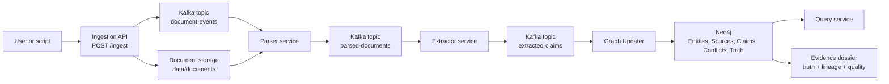
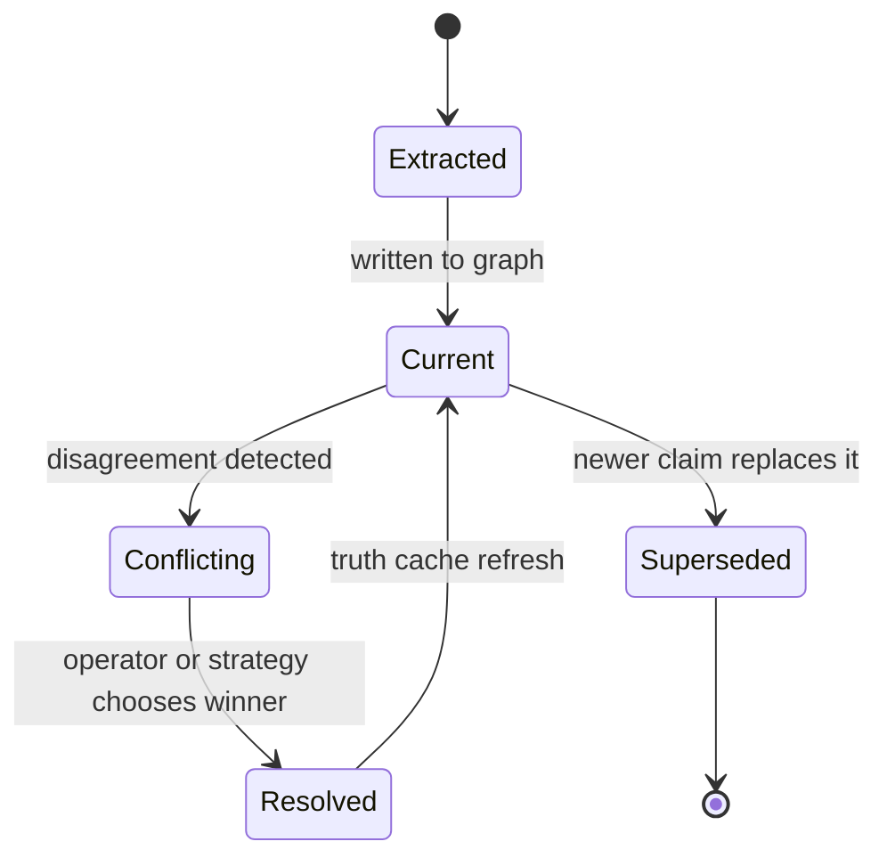

# DocWeave

DocWeave turns documents into a queryable knowledge graph.

In beginner terms: a document sentence like `Acme Corporation is headquartered in San Francisco` becomes a structured claim:

```text
Acme Corporation --headquartered_in--> San Francisco
```

The project is a small service pipeline:

```text
Upload document
  -> parse text
  -> extract entities and claims
  -> write claims to Neo4j
  -> detect conflicts
  -> query current truth
```

The important design choice is that DocWeave does not treat an answer as a blob of text. It separates:

- sources: where information came from
- claims: what a source says
- conflicts: where sources disagree
- truth: the current best view, with evidence attached
- dossiers: one packet that explains why the graph believes something

## Who This Is For

- New to tech: start with the quick start and sample document.
- Docker users: use `make dev`, `make health`, and `make demo`.
- Python developers: run `make test` and work inside the service folders.
- Container users: the graph-updater image is published as `ghcr.io/d3v07/docweave/graph-updater`.
- Operators: see `services/graph_updater/k8s` and `services/graph_updater/monitoring`.
- Demo viewers: use the sample documents in `data/samples`.

## Architecture



| Service | Port | Role |
| --- | ---: | --- |
| Ingestion | 8001 | Receives files through `POST /ingest` and stores them |
| Parser | 8002 | Reads stored files and publishes parsed text |
| Extractor | 8003 | Extracts entities, relationships, and claims |
| Graph Updater | 8004 | Writes claims, detects conflicts, and maintains truth |
| Query Service | 8005 | Searches the graph |
| Neo4j | 7474, 7687 | Stores the graph |
| Kafka | 9092 | Moves events between services |

Kafka topics:

- `document-events`
- `parsed-documents`
- `extracted-claims`
- `graph-updates`
- `conflicts`

Claim lifecycle:



## Quick Start

Requirements:

- Docker Desktop
- Docker Compose
- Python 3.11+ if you want to run tests locally

Start everything:

```bash
make dev
```

Check service health:

```bash
make health
```

Run the sample flow:

```bash
make demo
```

That uploads `data/samples/acme_press_release.txt`, waits for the pipeline, searches graph-updater for `Acme`, then reads current truth for Acme Corporation.

Run the richer story demo:

```bash
make story
```

That ingests every sample document, requeues duplicates if needed, then prints:

- an entity dossier for Acme Corporation
- a source impact report for the Acme sample source

Stop services:

```bash
make down
```

## Manual API Flow

Upload a document:

```bash
curl -X POST \
  -F "file=@data/samples/acme_press_release.txt;type=text/plain" \
  http://localhost:8001/ingest
```

Search graph-updater entities:

```bash
curl "http://localhost:8004/entity/search?query=Acme&limit=5"
```

Add a claim directly:

```bash
curl -X POST http://localhost:8004/claim \
  -H "Content-Type: application/json" \
  -d '{
    "subject_entity_id": "ent_acme",
    "predicate": "headquartered_in",
    "object_value": "San Francisco",
    "source_id": "src_demo",
    "confidence": 0.95
  }'
```

Read current truth:

```bash
curl http://localhost:8004/entity/ent_acme/truth
```

Read the evidence dossier:

```bash
curl http://localhost:8004/entity/ent_organization_acme_corporation/dossier
```

The dossier is the best beginner-facing object in the system. It shows the entity, current truth, supporting claims, source lineage, unresolved conflicts, a claim timeline, quality signals, and deterministic follow-up actions.

Check the impact of one source:

```bash
curl http://localhost:8004/source/doc_b31c1921d6dd0aef/impact
```

This answers: if this source is wrong, which entities, claims, predicates, and conflicts are affected?

List unresolved conflicts:

```bash
curl http://localhost:8004/conflicts
```

## Graph Updater Package

The public container package is:

```bash
docker pull ghcr.io/d3v07/docweave/graph-updater:latest
```

Build it locally:

```bash
make graph-updater-image
```

The Python package path is `services.graph_updater`; the external service, image, and container names stay `graph-updater`.

## Development

Run checks:

```bash
make test
```

Graph-updater-specific files live in `services/graph_updater`.

Important endpoints:

- `GET /health`
- `GET /ready`
- `POST /entity`
- `GET /entity/search`
- `POST /claim`
- `POST /claim/batch`
- `GET /conflicts`
- `POST /conflicts/{id}/resolve`
- `GET /entity/{id}/truth`
- `GET /entity/{id}/dossier`
- `GET /source/{id}/impact`

Admin endpoints require `X-API-Key` when configured.

## System Design Direction

See [docs/system-design.md](docs/system-design.md) for the fuller design map.

DocWeave is closest to an evidence-first GraphRAG foundation:

- It already follows the indexing spine: extract entities, relationships, and claims from raw text.
- The graph-updater keeps source lineage and conflict state instead of flattening everything into a final answer.
- Dossiers give local, entity-centered retrieval context: facts, evidence, source trust, conflicts, and next questions.
- The next major leap is hybrid retrieval: combine exact graph traversal with full-text/vector retrieval over source chunks, then use the dossier as the grounded context package.

Design influences:

- [Microsoft GraphRAG indexing](https://microsoft.github.io/graphrag/index/overview/) describes extraction of entities, relationships, claims, community structure, and embeddings from text.
- [Neo4j GraphRAG](https://neo4j.com/labs/genai-ecosystem/graphrag/) emphasizes graph-backed retrieval with source traceability and multi-hop context.
- [OpenTelemetry messaging conventions](https://opentelemetry.io/docs/specs/semconv/messaging/) are the right reference point for future Kafka tracing and operator visibility.

## Current Limits

- The repo does not include a product dashboard source. Use the API and Grafana monitoring files for now.
- Extraction is rule-based and works best on straightforward business text.
- Embedding endpoints are optional; the default Docker image keeps them disabled unless `sentence-transformers` is added to a custom extractor image.
- Neo4j runs as a single local instance in the default Compose setup.
- Conflict resolution exists, but human review workflows are API-level in this version.

## License

MIT
