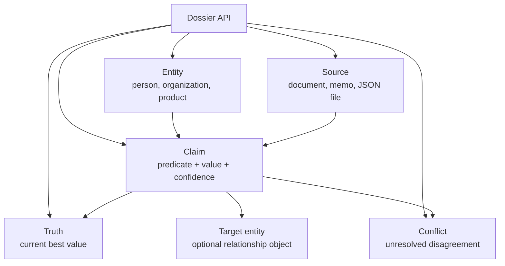
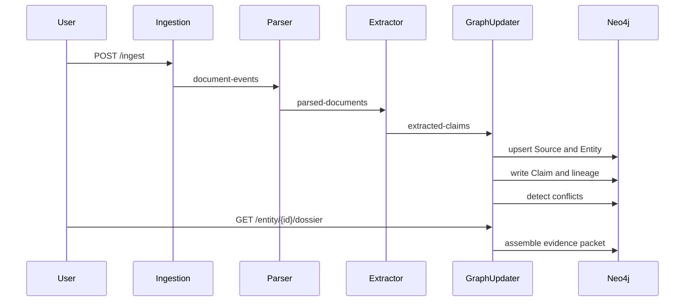

# DocWeave System Design

DocWeave is an evidence graph for changing documents. Its job is not only to extract facts, but to keep the argument behind each fact.

## Product Thesis

Most document systems answer a question by finding nearby text. DocWeave should answer by assembling an evidence packet:

1. Which entity is being discussed?
2. What claims exist about that entity?
3. Which sources support each claim?
4. Where do sources disagree?
5. What is the current best truth?
6. What should an operator verify next?

The graph-updater now exposes that packet through `GET /entity/{id}/dossier`.

## Read Model

## Write Model

## Retrieval Direction

Current retrieval is entity-centered:

- `GET /entity/search` finds graph entities.
- `GET /entity/{id}/truth` returns the current best values.
- `GET /entity/{id}/dossier` returns a richer local context packet.
- `GET /source/{id}/impact` shows source blast radius.

The next retrieval step should be hybrid:

- exact graph traversal for known entities and relationships
- full-text search for source chunks
- vector retrieval for semantic matches
- graph expansion from retrieved entities
- dossier packaging before response generation

This follows the same direction described by [Neo4j GraphRAG](https://neo4j.com/labs/genai-ecosystem/graphrag/) and [Microsoft GraphRAG](https://microsoft.github.io/graphrag/index/overview/), while keeping DocWeave's core contract source-first and explainable.

## Operator Direction

Operationally, the next leap is observability across Kafka hops. [OpenTelemetry messaging conventions](https://opentelemetry.io/docs/specs/semconv/messaging/) are the right baseline for future traces and metrics.

Important future signals:

- document ID from ingest to graph write
- Kafka topic and partition
- parse time, extraction time, graph write time
- claim count per document
- conflict count per document
- dead-letter count per service
- dossier assembly latency

## Design Rules

- Keep source lineage attached to every claim.
- Never hide conflict state inside a single flattened answer.
- Prefer deterministic quality signals before adding another model dependency.
- Keep the first-run path one command, one sample, one queryable truth.
- Add advanced retrieval only after the evidence graph stays easy to inspect.
